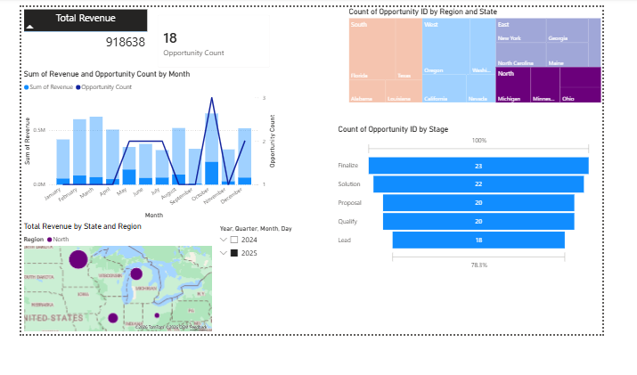
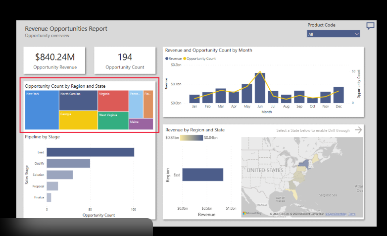
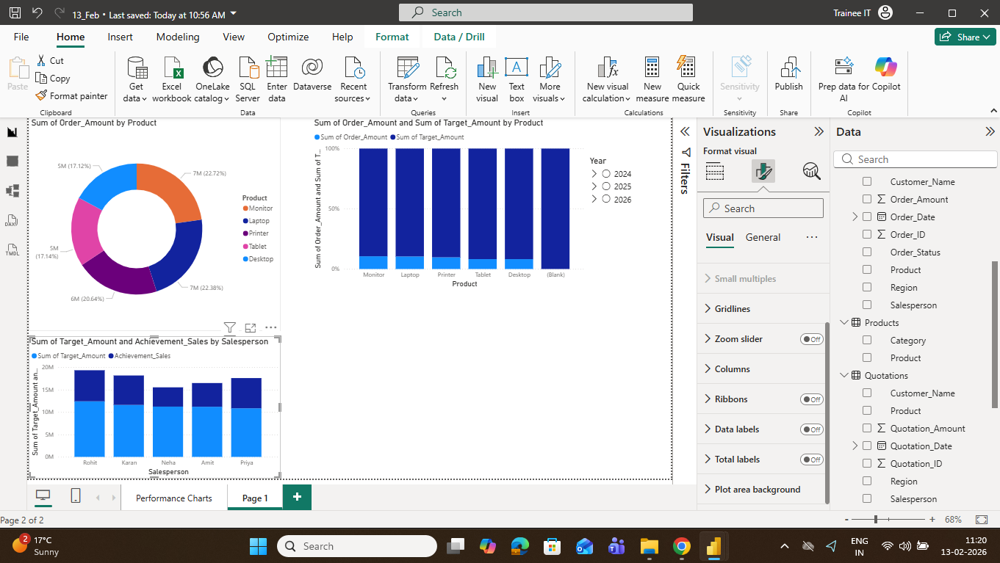
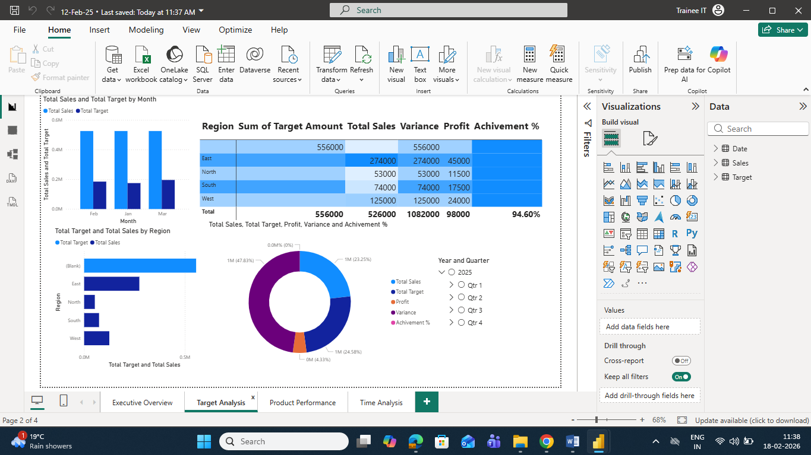
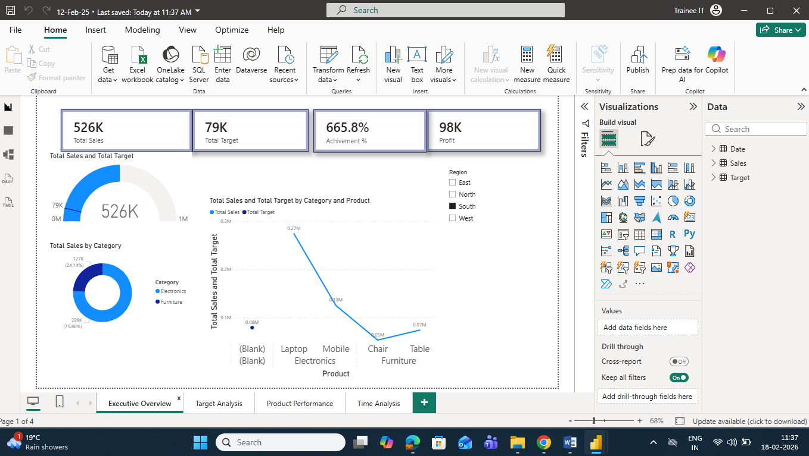
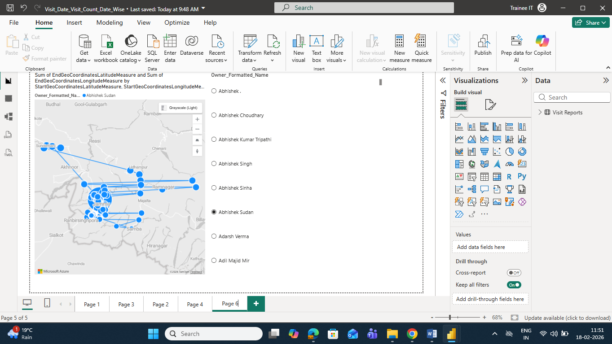
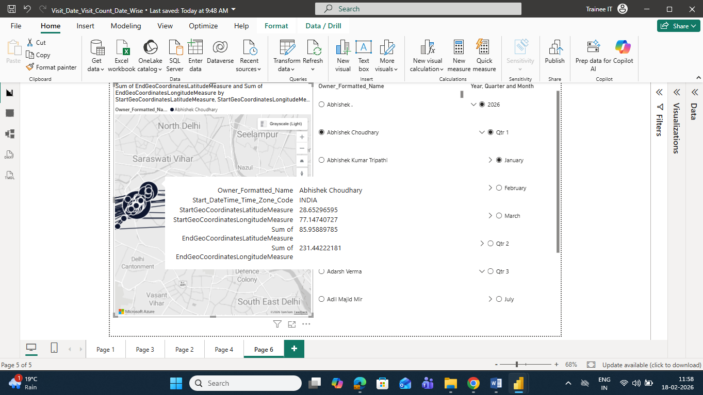
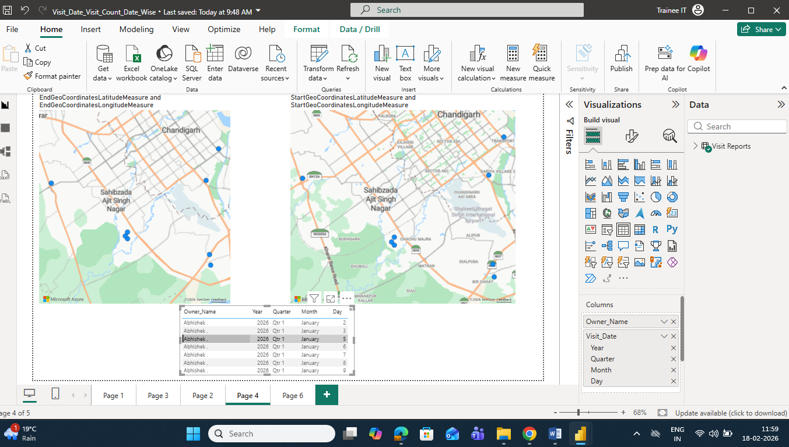

## 🖼️ Dashboard Screenshots & Detailed Insights

---

### 1️⃣ Total Revenue & Region-wise Performance

This dashboard provides a consolidated view of total revenue generated across all regions. It helps identify high-performing and low-performing sales regions through comparative visualizations.

**Key Insights:**

* Region-wise revenue contribution
* Identification of top revenue zones
* Performance gaps between regions

---

### 2️⃣ Revenue Opportunity Analysis

This report highlights potential revenue opportunities by analyzing reporting data and sales gaps.

**Key Insights:**

* Untapped sales regions
* Growth opportunity segments
* Revenue improvement areas

---

### 3️⃣ Order Amount by Product

Displays product-wise order value distribution, helping analyze which products generate maximum revenue.

**Key Insights:**

* High-demand products
* Low-performing product lines
* Product contribution to total sales

---

### 4️⃣ Region-wise Target vs Sales Variance & Profit %

This dashboard compares regional sales targets against actual performance while also tracking profit percentages.

**Key Insights:**

* Target achievement levels
* Sales variance analysis
* Region-wise profitability trends

---

### 5️⃣ Total Sales by Product

Provides a summarized view of total sales generated by each product category.

**Key Insights:**

* Product category performance
* Revenue distribution by product
* Sales concentration areas

---

### 6️⃣ Route Details Visualization (Azure Maps)

This geospatial dashboard visualizes salesperson travel routes using Azure Maps. It tracks movement paths between visit locations.

**Key Insights:**

* Field travel coverage
* Route optimization opportunities
* Travel path tracking

---

### 7️⃣ Salesperson Location Details — Latitude & Longitude (Azure Maps)

Displays salesperson visit locations plotted using latitude and longitude coordinates.

**Key Insights:**

* Exact visit locations
* Territory coverage mapping
* Geo-distribution of visits

---

### 8️⃣ Travel Routes & Movement Tracking (Azure Maps)

This visualization tracks end-to-end movement routes of salespersons based on geo-coordinates.

**Key Insights:**

* Daily movement patterns
* Distance coverage analysis
* Productivity vs travel correlation

---

## 📊 Analytical Capabilities Demonstrated

* Geospatial Data Analysis
* Latitude–Longitude Mapping
* Route & Movement Tracking
* KPI Dashboard Development
* Revenue & Sales Analytics
* Target Variance Analysis
* Product Performance Evaluation

---

*All dashboards were developed using Power BI with Azure Maps integration as part of a Data Analyst internship project.*
