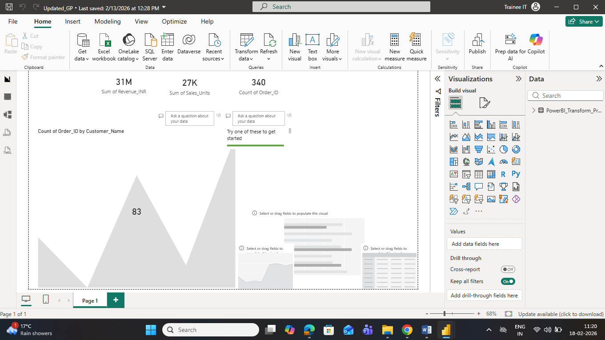
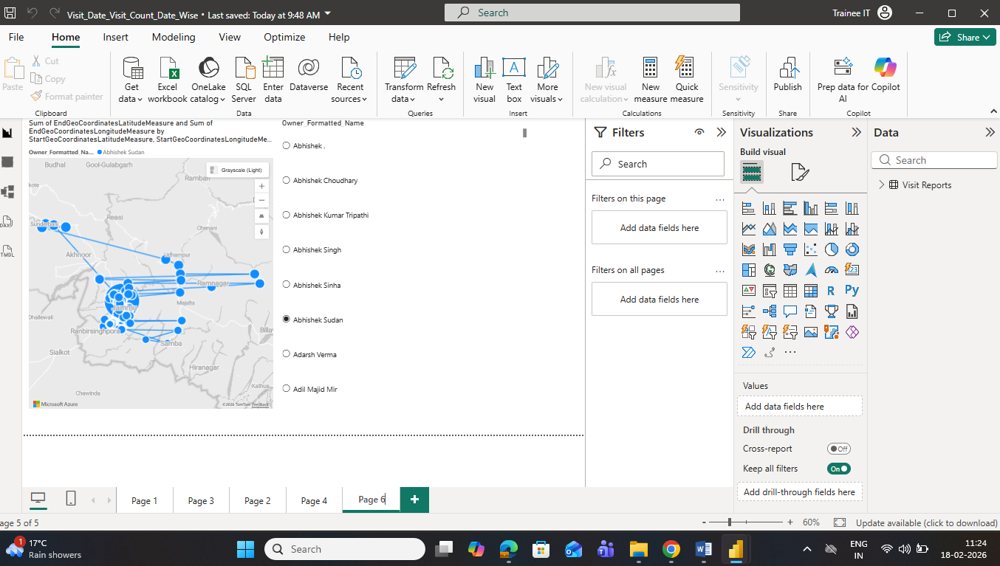

# Salesperson Visit & Sales Analysis Dashboard

## 📊 Project Overview

This repository contains Power BI dashboards developed to analyze salesperson visits, travel distance, and sales performance using business datasets.

The dashboards help track field staff productivity, visit frequency, travel coverage, and sales insights through interactive visualizations.

---

## 🛠️ Tools & Technologies Used

* Power BI Desktop
* Azure Maps
* Excel Dataset
* SQL (Data Extraction)

---

## 🔑 Key Dashboard Features

* Salesperson Visit Count Tracking
* Visit Date & Time Analysis
* Distance Covered Measurement
* Region-wise Visit Insights
* Sales Performance Reporting
* KPI Metrics Visualization
* Dynamic Slicers & Filters
* Map-based Location Tracking

---

## 🗂️ Dashboard Files Included

| File Name                             | Description                                     |
| ------------------------------------- | ----------------------------------------------- |
| 13_Feb.pbix                           | Daily visit and sales dashboard                 |
| Map_Details.pbix                      | Location & route visualization using Azure Maps |
| Sales_Report_9_Feb.pbix               | Sales performance analysis report               |
| Updated_GP.pbix                       | KPI & business performance dashboard            |
| Visit_Date_Visit_Count_Date_Wise.pbix | Date-wise visit tracking dashboard              |

---

## 🖼️ Dashboard Screenshots

### Visit & KPI Overview

### Sales & Visit Analysis

---

## 📈 Insights Generated

* Identified high-activity sales regions
* Tracked total distance covered by field staff
* Monitored daily visit productivity
* Evaluated salesperson performance
* Analyzed visit trends date-wise

---

## 📁 Repository Contents

* Power BI Dashboard Files (.pbix)
* Sales & Visit Datasets
* Dashboard Screenshots
* KPI Reports

---

## 🚀 Use Case

This project was developed to support business operations by providing actionable insights into field sales activities and performance tracking.

---

*Developed as part of Data Analyst internship work using organizational datasets.*
